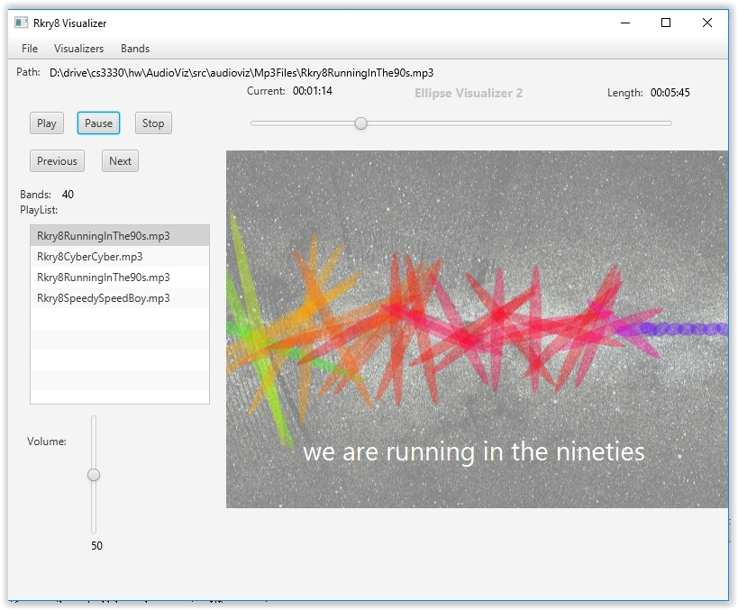

# AudioVis Slider/Karaoke Player

It's a player that can play musics with karaoke lyric, also with some cool visual effects.

# New Features!

 - Time seeking bar.
 - Display one digit after the decimal point for the numerical values displayed after Length: and Current: in the user interface.
Volume controlling bar.
 - The background universe picture is moving!
 - A playlist allows the user adding multiple songs at the same time.
 - Display lyrics.
 - The current visualizer name is shining.
 - Next and Previous button for next/previous song
 - MVC structure

You can also:
  - Remove the songs in the list by clicking mouse's left button and right button at the same time

## Result
* Test with mp3 file and txt file in the package

